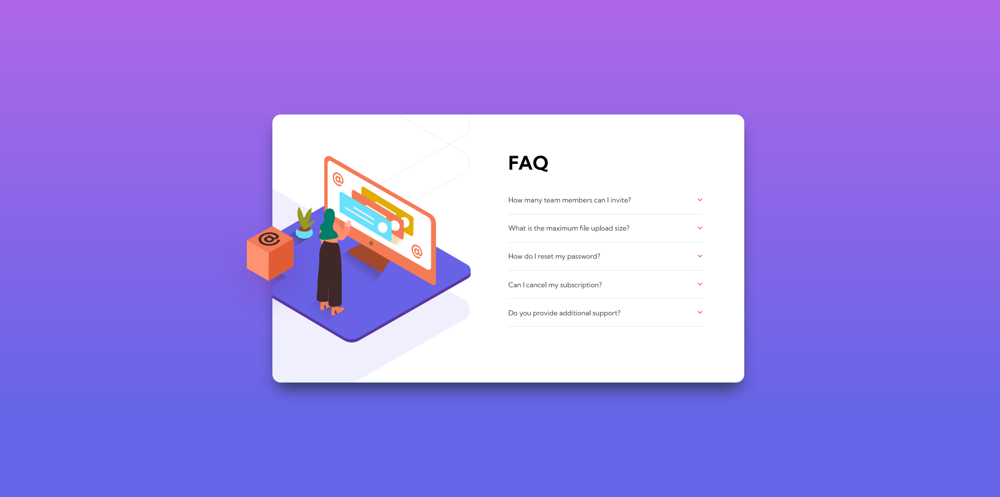

# Frontend Mentor - FAQ accordion card solution

This is a solution to the [FAQ accordion card challenge on Frontend Mentor](https://www.frontendmentor.io/challenges/faq-accordion-card-XlyjD0Oam). Frontend Mentor challenges help you improve your coding skills by building realistic projects. 

## Overview

### The challenge

Users should be able to:

- View the optimal layout for the component depending on their device's screen size
- See hover states for all interactive elements on the page
- Hide/Show the answer to a question when the question is clicked

### Screenshot

### Links

- Live Site URL: [Link](https://your-live-site-url.com)

## My process

### Built with

- Semantic HTML5 markup
- CSS custom properties
- Flexbox
- CSS Grid
- Mobile-first workflow

- [Sass](https://sass-lang.com/) - For styles

### Useful resources

- [Stack Overflow](https://stackoverflow.com/questions/37745154/only-open-one-accordion-tab-at-one-time) - This thread really helped me to make the accordion function correctly. I tweaked it a little bit to add the 'first' class which would make the second question panel opened by default. 

## Author

`Emi Acerbi`

## Acknowledgments

As usual, thanks to Frontend Mentor for the awesome challenge! [Frontend Mentor](https://www.frontendmentor.io/)
